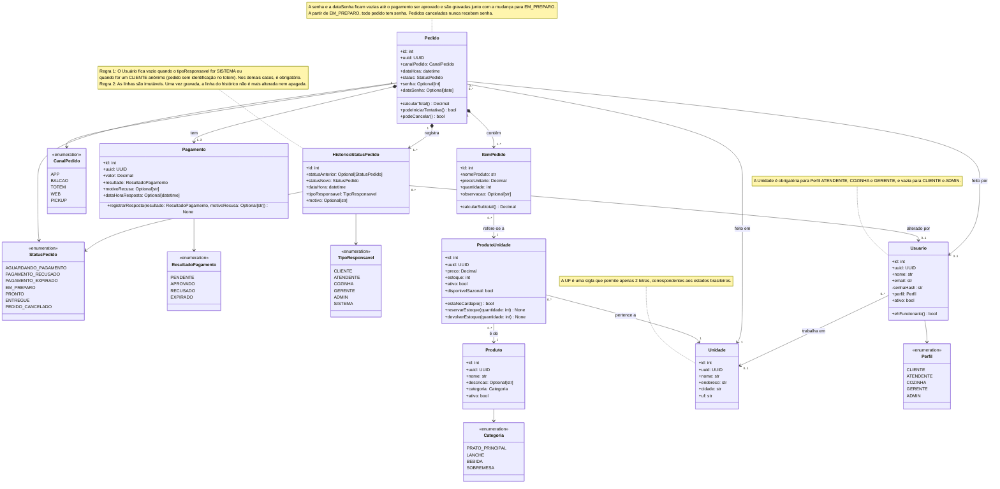

```mermaid
classDiagram
    class Pedido {
        +id: int
        +uuid: UUID
        +canalPedido: CanalPedido
        +dataHora: datetime
        +status: StatusPedido
        +senha: Optional[int]
        +dataSenha: Optional[date]
        +calcularTotal() Decimal
        +podeIniciarTentativa() bool
        +podeCancelar() bool
    }
    class ItemPedido {
        +id: int
        +nomeProduto: str
        +precoUnitario: Decimal
        +quantidade: int
        +observacao: Optional[str]
        +calcularSubtotal() Decimal
    }
    class CanalPedido {
        <<enumeration>>
        APP
        BALCAO
        TOTEM
        WEB
        PICKUP
    }
    class StatusPedido {
        <<enumeration>>
        AGUARDANDO_PAGAMENTO
        PAGAMENTO_RECUSADO
        PAGAMENTO_EXPIRADO
        EM_PREPARO
        PRONTO
        ENTREGUE
        PEDIDO_CANCELADO
    }
    class Pagamento {
        +id: int
        +uuid: UUID
        +valor: Decimal
        +resultado: ResultadoPagamento
        +motivoRecusa: Optional[str]
        +dataHoraResposta: Optional[datetime]
        +registrarResposta(resultado: ResultadoPagamento, motivoRecusa: Optional[str]) None
    }
    class ResultadoPagamento {
        <<enumeration>>
        PENDENTE
        APROVADO
        RECUSADO
        EXPIRADO
    }
    class HistoricoStatusPedido {
        +id: int
        +statusAnterior: Optional[StatusPedido]
        +statusNovo: StatusPedido
        +dataHora: datetime
        +tipoResponsavel: TipoResponsavel
        +motivo: Optional[str]
    }
    class TipoResponsavel {
        <<enumeration>>
        CLIENTE
        ATENDENTE
        COZINHA
        GERENTE
        ADMIN
        SISTEMA
    }
    class Produto {
        +id: int
        +uuid: UUID
        +nome: str
        +descricao: Optional[str]
        +categoria: Categoria
        +ativo: bool
    }
    class ProdutoUnidade {
        +id: int
        +uuid: UUID
        +preco: Decimal
        +estoque: int
        +ativo: bool
        +disponivelSazonal: bool
        +estaNoCardapio() bool
        +reservarEstoque(quantidade: int) None
        +devolverEstoque(quantidade: int) None
    }
    class Unidade {
        +id: int
        +uuid: UUID
        +nome: str
        +endereco: str
        +cidade: str
        +uf: str
    }
    class Categoria {
        <<enumeration>>
        PRATO_PRINCIPAL
        LANCHE
        BEBIDA
        SOBREMESA
    }
    class Usuario {
        +id: int
        +uuid: UUID
        +nome: str
        +email: str
        -senhaHash: str
        +perfil: Perfil
        +ativo: bool
        +ehFuncionario() bool
    }
    class Perfil {
        <<enumeration>>
        CLIENTE
        ATENDENTE
        COZINHA
        GERENTE
        ADMIN
    }


    Pedido "1" *--> "1..*" ItemPedido : contém
    Pedido --> CanalPedido
    Pedido --> StatusPedido
    Pagamento --> ResultadoPagamento

    Pedido "1" *--> "1..3" Pagamento : tem
    Pedido "1" *--> "1..*" HistoricoStatusPedido : registra
    HistoricoStatusPedido --> TipoResponsavel
    HistoricoStatusPedido --> StatusPedido
    HistoricoStatusPedido "0..*" --> "0..1" Usuario : alterado por

    ProdutoUnidade "0..*" --> "1" Produto : é de
    ProdutoUnidade "0..*" --> "1" Unidade : pertence a
    ItemPedido "0..*" --> "1" ProdutoUnidade : refere-se a
    Produto --> Categoria

    Pedido "0..*" --> "1" Unidade : feito em
    Usuario "0..*" --> "0..1" Unidade : trabalha em 
    Pedido "0..*" --> "0..1" Usuario : feito por
    Usuario --> Perfil

    note for HistoricoStatusPedido "Regra 1: O Usuário fica vazio quando o tipoResponsavel for SISTEMA ou <br> quando for um CLIENTE anônimo (pedido sem identificação no totem). Nos demais casos, é obrigatório. <br>Regra 2: As linhas são imutáveis. Uma vez gravada, a linha do histórico não é mais alterada nem apagada."
    note for Unidade "A UF é uma sigla que permite apenas 2 letras, correspondentes aos estados brasileiros."
    note for Usuario "A Unidade é obrigatória para Perfil ATENDENTE, COZINHA e GERENTE, e vazia para CLIENTE e ADMIN."
    note for Pedido "A senha e a dataSenha ficam vazias até o pagamento ser aprovado e são gravadas junto com a mudança para EM_PREPARO. <br>A partir de EM_PREPARO, todo pedido tem senha. Pedidos cancelados nunca recebem senha."
```
