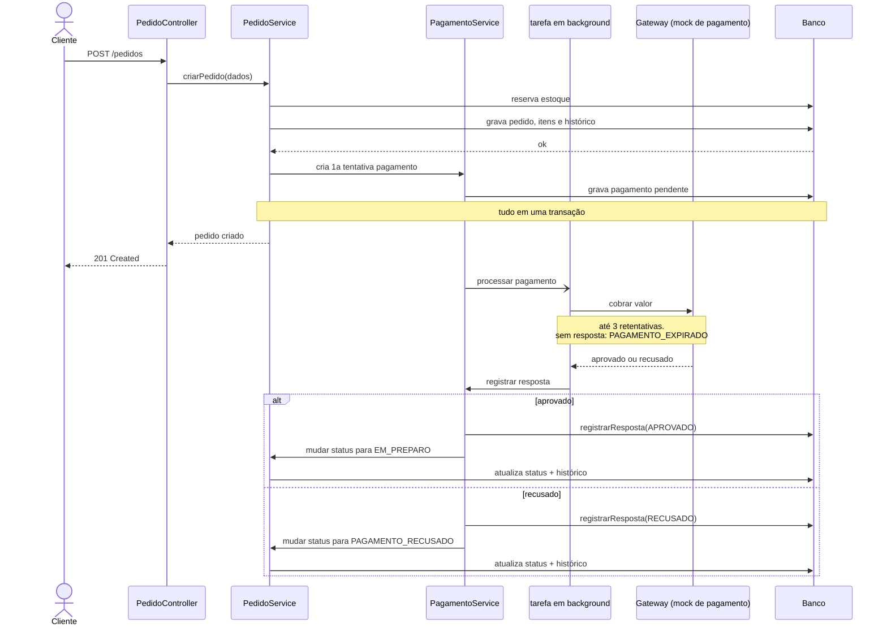

```mermaid
sequenceDiagram
        actor Cliente
        participant PedAPI as PedidoController
        participant PedSvc as PedidoService
        participant PagSvc as PagamentoService
        participant TarBack as tarefa em background
        participant Gateway as Gateway (mock de pagamento)
        participant BD as Banco

        Cliente->>PedAPI: POST /pedidos
        PedAPI->>PedSvc: criarPedido(dados)
        PedSvc->>BD: reserva estoque
        PedSvc->>BD: grava pedido, itens e histórico
        BD-->>PedSvc: ok
        PedSvc->>PagSvc: cria 1a tentativa pagamento
        PagSvc->>BD: grava pagamento pendente
        Note over PedSvc,BD: tudo em uma transação
        PedSvc-->>PedAPI: pedido criado
        PedAPI-->>Cliente: 201 Created
        PagSvc-)TarBack: processar pagamento
        TarBack->>Gateway: cobrar valor
        Note over TarBack,Gateway: até 3 retentativas. <br>sem resposta: PAGAMENTO_EXPIRADO
        Gateway-->>TarBack: aprovado ou recusado
        TarBack->>PagSvc: registrar resposta
        
        alt aprovado
            PagSvc->>BD: registrarResposta(APROVADO)
            PagSvc->>PedSvc: mudar status para EM_PREPARO
            PedSvc->>BD: atualiza status + histórico
        else recusado
            PagSvc->>BD: registrarResposta(RECUSADO)
            PagSvc->>PedSvc: mudar status para PAGAMENTO_RECUSADO
            PedSvc->>BD: atualiza status + histórico
        end
```