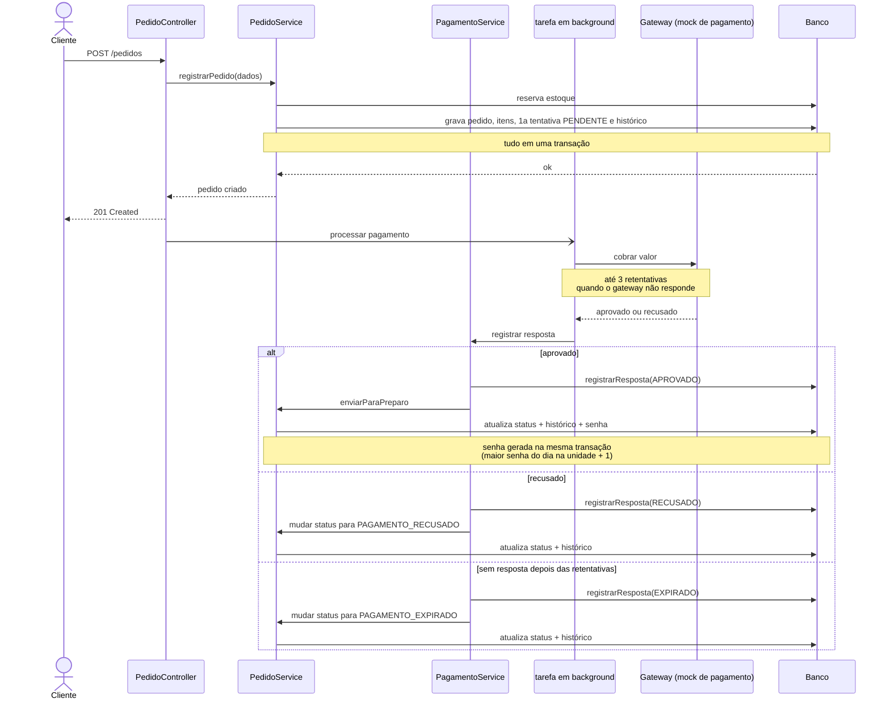

```mermaid
sequenceDiagram
        actor Cliente
        participant PedAPI as PedidoController
        participant PedSvc as PedidoService
        participant PagSvc as PagamentoService
        participant TarBack as tarefa em background
        participant Gateway as Gateway (mock de pagamento)
        participant BD as Banco

        Cliente->>PedAPI: POST /pedidos
        PedAPI->>PedSvc: registrarPedido(dados)
        PedSvc->>BD: reserva estoque
        PedSvc->>BD: grava pedido, itens, 1a tentativa PENDENTE e histórico
        Note over PedSvc,BD: tudo em uma transação
        BD-->>PedSvc: ok
        PedSvc-->>PedAPI: pedido criado
        PedAPI-->>Cliente: 201 Created
        PedAPI-)TarBack: processar pagamento
        TarBack->>Gateway: cobrar valor
        Note over TarBack,Gateway: até 3 retentativas <br>quando o gateway não responde
        Gateway-->>TarBack: aprovado ou recusado
        TarBack->>PagSvc: registrar resposta

        alt aprovado
            PagSvc->>BD: registrarResposta(APROVADO)
            PagSvc->>PedSvc: enviarParaPreparo
            PedSvc->>BD: atualiza status + histórico + senha
            Note over PedSvc,BD: senha gerada na mesma transação <br>(maior senha do dia na unidade + 1)
        else recusado
            PagSvc->>BD: registrarResposta(RECUSADO)
            PagSvc->>PedSvc: mudar status para PAGAMENTO_RECUSADO
            PedSvc->>BD: atualiza status + histórico
        else sem resposta depois das retentativas
            PagSvc->>BD: registrarResposta(EXPIRADO)
            PagSvc->>PedSvc: mudar status para PAGAMENTO_EXPIRADO
            PedSvc->>BD: atualiza status + histórico
        end
```